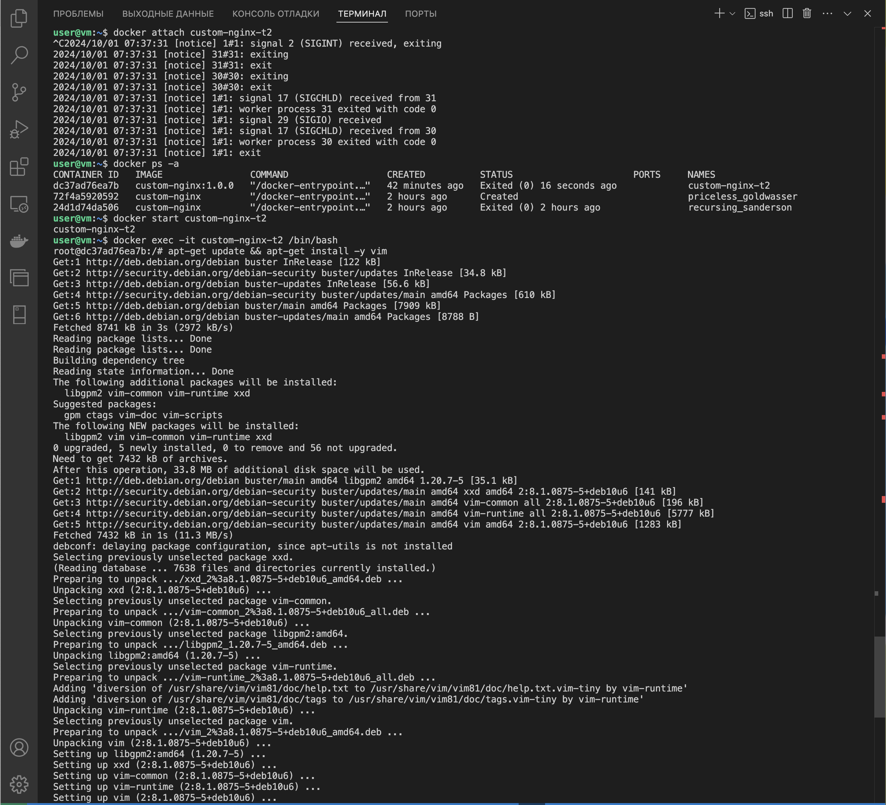
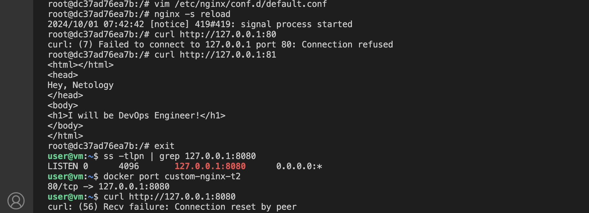

# Docker-Compose

## Task 1
[Ссылка на Docker Hub](https://hub.docker.com/repository/docker/evgeniyabal/custom-nginx/general)

## Task 2

## Task 3

Контейнер будет в состоянии "Exited". Это произошло потому, что при нажатии Ctrl-C, прерывается основное приложение (Nginx), которое работает внутри контейнера, и контейнер завершил свою работу, так как в Docker контейнеры работают до тех пор, пока основное приложение не завершится.

Проблема, скорее всего, в том, что Nginx теперь слушает на порту 81, а docker port custom-nginx-t2 может быть настроен на проброс порта 80 к 8080 на хосте, что означает, что запросы на http://127.0.0.1:8080 не перенаправляются на новый порт 81 внутри контейнера.
Порт 8080 на хосте по-прежнему пробрасывается к порту 80 внутри контейнера, но Nginx больше не слушает на порту 80.

## Task 4

## Task 5
